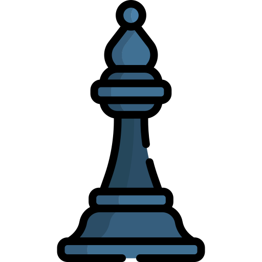
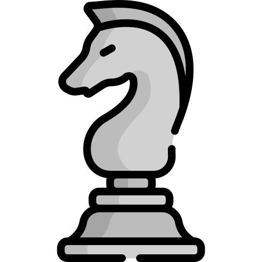

  

 

 

# 💫 About Me:
👋 Hi there! I'm Panagiotis, a junior backend software engineer with a strong foundation in C-like languages  and Python. My expertise lies in building efficient and scalable software solutions for various domains.  💻 As a dedicated Linux user and enthusiast, I'm well-versed in system administration, shell scripting, and optimizing workflows for productivity.  🔒 I have a keen interest in cybersecurity and ethical hacking,  actively exploring techniques to enhance system security and mitigate vulnerabilities.  🚀 Outside of coding, I enjoy delving into the latest advancements in technology, staying updated on cybersecurity trends, and participating in Capture The Flag (CTF) competitions to sharpen my skills.  ⚠️I also maintain an active presence on LeetCode and HackerRank, where I continuously hone my problem-solving skills and algorithmic proficiency. With a solid grasp of data structures and algorithms, I tackle a wide range of coding challenges, from fundamental problems to advanced algorithmic puzzles.  Leveraging languages such as C, C++, and others, I strive to optimize solutions for efficiency and scalability.  Consistently participating in LeetCode contests and exploring community discussions, I remain committed to refining my coding skills and  staying abreast of industry best practices.   🌟 I'm passionate about collaborating on projects that push the boundaries of innovation and contribute positively to the tech community. Let's connect and create something impactful together!

 

## 🌐 My Socials 🌐

 
 
 
 
 
 
 
 
 

 

## 📲 Coding Platforms 📲

 

# 💻 Tech Stack 💻
 
 
 
 
 
 
 
 
 
 
 
 

 
 
 
 
 
 
 
 
 
 
 

 
 
 
 

 
 
 
 

 

  
# 📊 GitHub Stats:

   
   
  
   

   
  
  

 

  
## 🔝 Top Contributed Repositories

  

 

  
## 🏆 GitHub Trophies

 
 

 

  
## 🛡️ Hacking & Penetration Testing Skills

  

 

  
# ♟️ High Level Online Chess Game ♟️

 
This is an open chess tournament where ANYONE can play. That's the fun part.  
It's your turn to play! Move a <!-- BEGIN TURN -->white<!-- END TURN --> piece.

<!-- BEGIN CHESS BOARD -->
|   | A | B | C | D | E | F | G | H |   |
|---|:-:|:-:|:-:|:-:|:-:|:-:|:-:|:-:|:-:|
| **8** |  |  |  |  |  |  |  |  | **8** |
| **7** |  |  |  |  |  |  |  |  | **7** |
| **6** |  |  |  |  |  |  |  |  | **6** |
| **5** |  |  |  |  |  |  |  |  | **5** |
| **4** |  |  |  |  |  |  |  |  | **4** |
| **3** |  |  |  |  |  |  |  |  | **3** |
| **2** |  |  |  |  |  |  |  |  | **2** |
| **1** |  |  |  |  |  |  |  |  | **1** |
|   | **A** | **B** | **C** | **D** | **E** | **F** | **G** | **H** |   |
<!-- END CHESS BOARD -->

**It's your turn to move! Choose one from the following table**
<!-- BEGIN MOVES LIST -->
|  FROM  | TO (Just click a link!) |
| :----: | :---------------------- |
| **A1** | [A2](https://github.com/milaabl/readme-chess/issues/new?body=Please+do+not+change+the+title.+Just+click+%22Submit+new+issue%22.+You+don%27t+need+to+do+anything+else+%3AD&title=Chess%3A+Move+A1+to+A2) |
| **A3** | [A4](https://github.com/milaabl/readme-chess/issues/new?body=Please+do+not+change+the+title.+Just+click+%22Submit+new+issue%22.+You+don%27t+need+to+do+anything+else+%3AD&title=Chess%3A+Move+A3+to+A4) |
| **B1** | [C3](https://github.com/milaabl/readme-chess/issues/new?body=Please+do+not+change+the+title.+Just+click+%22Submit+new+issue%22.+You+don%27t+need+to+do+anything+else+%3AD&title=Chess%3A+Move+B1+to+C3), [D2](https://github.com/milaabl/readme-chess/issues/new?body=Please+do+not+change+the+title.+Just+click+%22Submit+new+issue%22.+You+don%27t+need+to+do+anything+else+%3AD&title=Chess%3A+Move+B1+to+D2) |
| **B2** | [B3](https://github.com/milaabl/readme-chess/issues/new?body=Please+do+not+change+the+title.+Just+click+%22Submit+new+issue%22.+You+don%27t+need+to+do+anything+else+%3AD&title=Chess%3A+Move+B2+to+B3), [B4](https://github.com/milaabl/readme-chess/issues/new?body=Please+do+not+change+the+title.+Just+click+%22Submit+new+issue%22.+You+don%27t+need+to+do+anything+else+%3AD&title=Chess%3A+Move+B2+to+B4) |
| **C1** | [D2](https://github.com/milaabl/readme-chess/issues/new?body=Please+do+not+change+the+title.+Just+click+%22Submit+new+issue%22.+You+don%27t+need+to+do+anything+else+%3AD&title=Chess%3A+Move+C1+to+D2), [E3](https://github.com/milaabl/readme-chess/issues/new?body=Please+do+not+change+the+title.+Just+click+%22Submit+new+issue%22.+You+don%27t+need+to+do+anything+else+%3AD&title=Chess%3A+Move+C1+to+E3), [F4](https://github.com/milaabl/readme-chess/issues/new?body=Please+do+not+change+the+title.+Just+click+%22Submit+new+issue%22.+You+don%27t+need+to+do+anything+else+%3AD&title=Chess%3A+Move+C1+to+F4), [G5](https://github.com/milaabl/readme-chess/issues/new?body=Please+do+not+change+the+title.+Just+click+%22Submit+new+issue%22.+You+don%27t+need+to+do+anything+else+%3AD&title=Chess%3A+Move+C1+to+G5) |
| **C2** | [C3](https://github.com/milaabl/readme-chess/issues/new?body=Please+do+not+change+the+title.+Just+click+%22Submit+new+issue%22.+You+don%27t+need+to+do+anything+else+%3AD&title=Chess%3A+Move+C2+to+C3), [C4](https://github.com/milaabl/readme-chess/issues/new?body=Please+do+not+change+the+title.+Just+click+%22Submit+new+issue%22.+You+don%27t+need+to+do+anything+else+%3AD&title=Chess%3A+Move+C2+to+C4) |
| **D1** | [D2](https://github.com/milaabl/readme-chess/issues/new?body=Please+do+not+change+the+title.+Just+click+%22Submit+new+issue%22.+You+don%27t+need+to+do+anything+else+%3AD&title=Chess%3A+Move+D1+to+D2), [D3](https://github.com/milaabl/readme-chess/issues/new?body=Please+do+not+change+the+title.+Just+click+%22Submit+new+issue%22.+You+don%27t+need+to+do+anything+else+%3AD&title=Chess%3A+Move+D1+to+D3), [D4](https://github.com/milaabl/readme-chess/issues/new?body=Please+do+not+change+the+title.+Just+click+%22Submit+new+issue%22.+You+don%27t+need+to+do+anything+else+%3AD&title=Chess%3A+Move+D1+to+D4), [E2](https://github.com/milaabl/readme-chess/issues/new?body=Please+do+not+change+the+title.+Just+click+%22Submit+new+issue%22.+You+don%27t+need+to+do+anything+else+%3AD&title=Chess%3A+Move+D1+to+E2) |
| **D5** | [D6](https://github.com/milaabl/readme-chess/issues/new?body=Please+do+not+change+the+title.+Just+click+%22Submit+new+issue%22.+You+don%27t+need+to+do+anything+else+%3AD&title=Chess%3A+Move+D5+to+D6) |
| **E1** | [E2](https://github.com/milaabl/readme-chess/issues/new?body=Please+do+not+change+the+title.+Just+click+%22Submit+new+issue%22.+You+don%27t+need+to+do+anything+else+%3AD&title=Chess%3A+Move+E1+to+E2) |
| **F1** | [A6](https://github.com/milaabl/readme-chess/issues/new?body=Please+do+not+change+the+title.+Just+click+%22Submit+new+issue%22.+You+don%27t+need+to+do+anything+else+%3AD&title=Chess%3A+Move+F1+to+A6), [B5](https://github.com/milaabl/readme-chess/issues/new?body=Please+do+not+change+the+title.+Just+click+%22Submit+new+issue%22.+You+don%27t+need+to+do+anything+else+%3AD&title=Chess%3A+Move+F1+to+B5), [C4](https://github.com/milaabl/readme-chess/issues/new?body=Please+do+not+change+the+title.+Just+click+%22Submit+new+issue%22.+You+don%27t+need+to+do+anything+else+%3AD&title=Chess%3A+Move+F1+to+C4), [D3](https://github.com/milaabl/readme-chess/issues/new?body=Please+do+not+change+the+title.+Just+click+%22Submit+new+issue%22.+You+don%27t+need+to+do+anything+else+%3AD&title=Chess%3A+Move+F1+to+D3), [E2](https://github.com/milaabl/readme-chess/issues/new?body=Please+do+not+change+the+title.+Just+click+%22Submit+new+issue%22.+You+don%27t+need+to+do+anything+else+%3AD&title=Chess%3A+Move+F1+to+E2), [G2](https://github.com/milaabl/readme-chess/issues/new?body=Please+do+not+change+the+title.+Just+click+%22Submit+new+issue%22.+You+don%27t+need+to+do+anything+else+%3AD&title=Chess%3A+Move+F1+to+G2), [H3](https://github.com/milaabl/readme-chess/issues/new?body=Please+do+not+change+the+title.+Just+click+%22Submit+new+issue%22.+You+don%27t+need+to+do+anything+else+%3AD&title=Chess%3A+Move+F1+to+H3) |
| **F3** | [D2](https://github.com/milaabl/readme-chess/issues/new?body=Please+do+not+change+the+title.+Just+click+%22Submit+new+issue%22.+You+don%27t+need+to+do+anything+else+%3AD&title=Chess%3A+Move+F3+to+D2), [D4](https://github.com/milaabl/readme-chess/issues/new?body=Please+do+not+change+the+title.+Just+click+%22Submit+new+issue%22.+You+don%27t+need+to+do+anything+else+%3AD&title=Chess%3A+Move+F3+to+D4), [E5](https://github.com/milaabl/readme-chess/issues/new?body=Please+do+not+change+the+title.+Just+click+%22Submit+new+issue%22.+You+don%27t+need+to+do+anything+else+%3AD&title=Chess%3A+Move+F3+to+E5), [G1](https://github.com/milaabl/readme-chess/issues/new?body=Please+do+not+change+the+title.+Just+click+%22Submit+new+issue%22.+You+don%27t+need+to+do+anything+else+%3AD&title=Chess%3A+Move+F3+to+G1), [G5](https://github.com/milaabl/readme-chess/issues/new?body=Please+do+not+change+the+title.+Just+click+%22Submit+new+issue%22.+You+don%27t+need+to+do+anything+else+%3AD&title=Chess%3A+Move+F3+to+G5) |
| **H2** | [G2](https://github.com/milaabl/readme-chess/issues/new?body=Please+do+not+change+the+title.+Just+click+%22Submit+new+issue%22.+You+don%27t+need+to+do+anything+else+%3AD&title=Chess%3A+Move+H2+to+G2), [H1](https://github.com/milaabl/readme-chess/issues/new?body=Please+do+not+change+the+title.+Just+click+%22Submit+new+issue%22.+You+don%27t+need+to+do+anything+else+%3AD&title=Chess%3A+Move+H2+to+H1), [H3](https://github.com/milaabl/readme-chess/issues/new?body=Please+do+not+change+the+title.+Just+click+%22Submit+new+issue%22.+You+don%27t+need+to+do+anything+else+%3AD&title=Chess%3A+Move+H2+to+H3) |
| **H4** | [G5](https://github.com/milaabl/readme-chess/issues/new?body=Please+do+not+change+the+title.+Just+click+%22Submit+new+issue%22.+You+don%27t+need+to+do+anything+else+%3AD&title=Chess%3A+Move+H4+to+G5), [H5](https://github.com/milaabl/readme-chess/issues/new?body=Please+do+not+change+the+title.+Just+click+%22Submit+new+issue%22.+You+don%27t+need+to+do+anything+else+%3AD&title=Chess%3A+Move+H4+to+H5) |
<!-- END MOVES LIST -->

Having fun? Ask a friend to do the next move!

#### How it works

When you click on a link and submit a new issue with the desired move, a GitHub action is triggered, which in turn runs a small python script that performs the specified movement, updates this README file and commits the changes.

  
Last 5 moves in this game

<!-- BEGIN LAST MOVES -->

| Move | Author |
| :--: | :----- |
| `H6` to `G5` | [ @Brandon-Huu](https://github.com/Brandon-Huu) |
| `G4` to `G5` | [ @zadif](https://github.com/zadif) |
| `H7` to `H6` | [ @IGR2014](https://github.com/IGR2014) |
| `H1` to `H2` | [ @milaabl](https://github.com/milaabl) |
| `F6` to `E4` | [ @IGR2014](https://github.com/IGR2014) |

<!-- END LAST MOVES -->

  
Top 10 most moves across all games

<!-- BEGIN TOP MOVES -->

| Total moves |  User  |
| :---------: | :----- |
| 21 | [@milaabl](https://github.com/milaabl) |
| 13 | [@przemek890](https://github.com/przemek890) |
| 8 | [@AzeemIdrisi](https://github.com/AzeemIdrisi) |
| 4 | [@b-hristov](https://github.com/b-hristov) |
| 3 | [@IGR2014](https://github.com/IGR2014) |
| 2 | [@CloverGit](https://github.com/CloverGit) |
| 2 | [@zadif](https://github.com/zadif) |
| 1 | [@kaisunoo](https://github.com/kaisunoo) |
| 1 | [@siosio34](https://github.com/siosio34) |
| 1 | [@AndreiLegram](https://github.com/AndreiLegram) |

<!-- END TOP MOVES -->

---

 

  

 

## 💰 You can help me by Donating

If you find my work helpful, consider supporting me:

  
  
  
  
  

 
 
 

